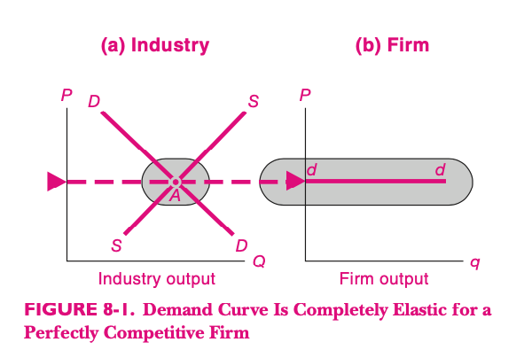
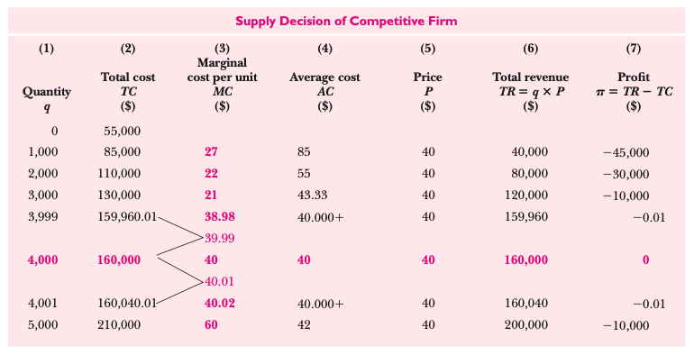
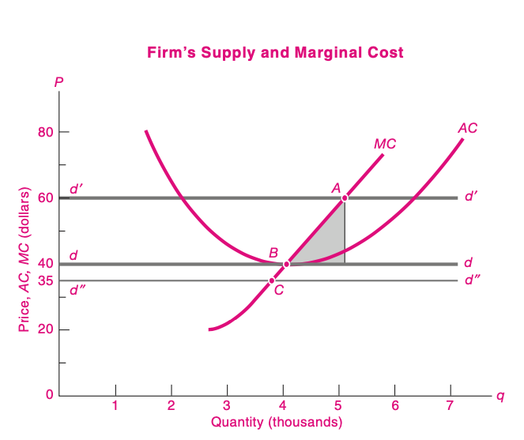
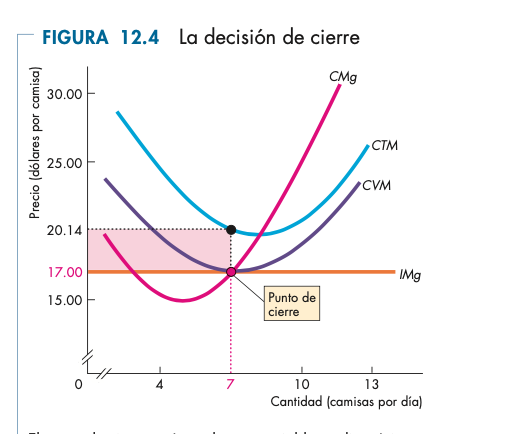
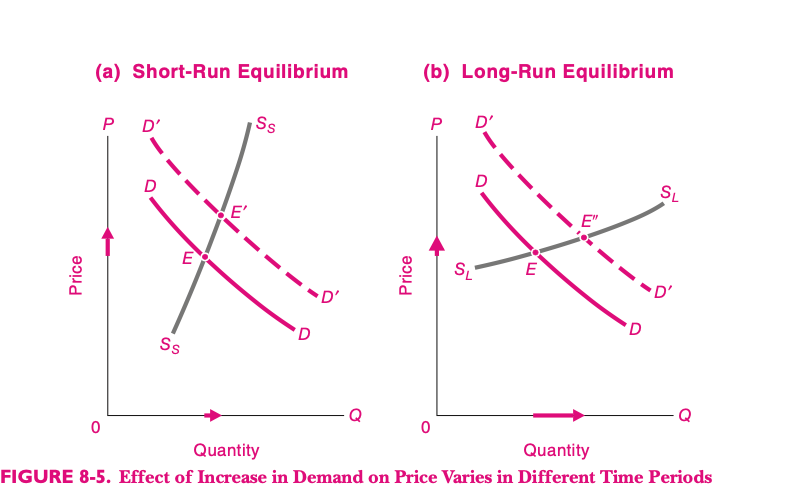
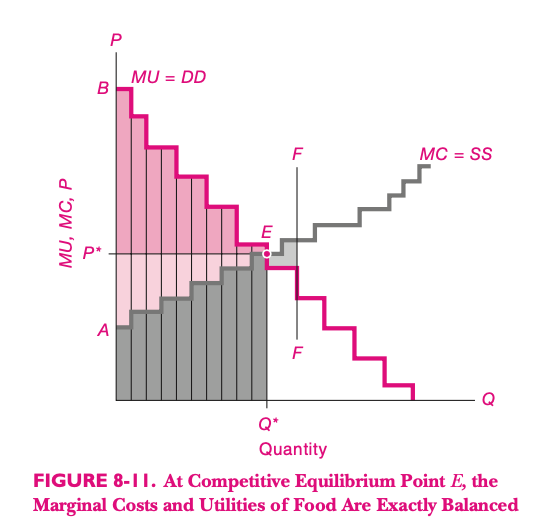

```{r setup, include=FALSE}
options(htmltools.dir.version = FALSE)
knitr::opts_chunk$set(
  fig.width=6, fig.height=3.5, fig.retina=3,
  out.width = "100%",
  cache = FALSE,
  echo = FALSE,
  message = FALSE, 
  warning = FALSE,
  hiline = TRUE,
  dev = "png", 
  dev.args = list(type = "cairo-png")
)

library(tibble)
library(ggplot2)
library(showtext)
library(purrr)
library(kableExtra)
library(tibble)
library(emo)
library(dplyr)
library(ggplot2)

font_add_google("Lato", "Lato")
font_add_google("Merriweather", "Merriweather")
theme_set(theme_minimal(base_family = 'Lato', base_size=16))

```

```{r xaringan-themer, include=FALSE, warning=FALSE}
library(xaringanthemer)


colores <- c(celeste="#5e82ae", 
             color3="#89a2c3",
             color1="#698BB4",
             color2="#5D81AD",
             verde="#4E7B7B")

# ,,5D81AD,,000000
style_mono_accent(
  base_color = "#5e82ae",
  #secondary_color = "",
  header_font_google = google_font("Lato"),
  text_font_google   = google_font("Merriweather"),
)
```


<style>

.center2 {
  margin: 0;
  position: absolute;
  top: 50%;
  left: 50%;
  -ms-transform: translate(-50%, -50%);
  transform: translate(-50%, -50%);
}

</style>


<style>

.center2 {
  margin: 0;
  position: absolute;
  top: 50%;
  left: 50%;
  -ms-transform: translate(-50%, -50%);
  transform: translate(-50%, -50%);
}

.remark-slide-content {

 height: 200px;
}

li {
  margin-bottom: 20px;
}

</style>


# Estructuras de Mercado y Organización Industrial


- Analizamos la oferta y la demanda.
- Oferta y demanda pueden interactuar de distintas formas dando lugar a distintas estructuras de mercado, según los oferentes y demandantes tengan mayor o menor __poder de mercado__.


---

# Tipología

- Hay muchos oferentes y demandantes y ninguno tiene poder de mercado: competencia perfecta.
- Un solo oferente concentra toda la oferta: monopolio.
- Varios casos intermedios, vamos a hablar de oligopolio y competencia monopolística.

---
# Competencia Perfecta

Analizamos estos mercados y el comportamiento de las empresas en base a dos supuestos:

- Los actores están _atomizados_ y no concentran poder.
- Maximizan beneficios.

---
# Demanda de mercado y demanda individal

La curva de demanda que enfrentan los productores en compentencia perfecta es horizontal.



---
# Motivación de los empresarios

¿Qué desean los empresarios? 
- ¿Vender lo más posible? `r emo::ji("x")`
- ¿Gastar lo menos posible? `r emo::ji("x")`
- Ganar las mayores ganancias posibles. `r emo::ji("white_check_mark")`


---
# Maximización de beneficios

- Los beneficios son la diferecia entre las ventas y los costos.
- Se pueden escribir como una función de la cantidad producida ($Q$):

$$B(Q)=PQ-C(Q)$$

---
# Maximiazación de Beneficios (2)

- El empresario elige $Q$ para maximizar beneficios.

- Suponemos que dada la cantidad producida, lo hace de la forma más eficiente posible.
- En competencia perfecta, no tiene control sobre $P$. El ingreso marginal es siempre igual al precio.
- El ingreso marginal debe ser igual al costo marginal:

$$ P = Cmg(Q)$$
---

# La curva de oferta.

- Para cada precio, el empresario elige la cantidad a producir que hace que su costo marginal sea igual a ese precio.


---

# Ejemplo 




---
# Oferta y Costo marginal



---
# Punto de cierre

.pull-left[
- La empresa tendrá pérdidas si __Precio__ es menor al __Costo Medio__.
- La empresa cerrará si el __Precio__ es menor al __Costo Variable Medio__.
]

.pull-right[


]


---

# Equilibrio de corto y largo plazo (1)


- Si hay un aumento en la demanda, los productores van a tener un incentivo a producir más para beneficiarse del aumento de precios.

- En el corto plazo, pueden aumentar la producción contratando factores __variables__ de producción, pero esto limita el aumento de la cantidad producida.

- En el largo plazo, pueden invertir y contratar una mayor cantidad de factores fijos de producción (capital).

- Esto implica que en el largo plazo la cantidad producida aumenta más, por lo que la elasticidad precio de la oferta en el largo plazo es __mayor__.


---
# Equilibrio de corto y largo plazo (2)




---
# Entrada y salida de empresas

- Si el precio de equilibrio está por abajo de los costos medios de las empresas, las empresas tienen pérdidas, y salen del mercado.
- Esto hace que la oferta disminuya y el precio suba.
- Si el precio de equilibrio está por arriba de los costos medios de las empresas, pasa lo contrario, y entran empresas al mercado.


---
# Eficiencia

- Eficiencia Paretiana.
- Un equilibrio es eficiente si no se puede mejorar la utilidad de ninguno de los agentes sin empeorar a otro.

---
# Mercados Competitivos y Eficiencia

- La demanda viene dada por la Utilidad Marginal
- La demanda viene dada por el Costo Marginal



---

# Eficiencia del equilibrio Competitivo

- En equilibrio, $$P=C Marg = U Marg $$
- Cualquier otro punto tiene menor excedente económico.
- Si la producción es menor que este equilibrio, el área entre las curvas es menor.
- Si la producción es mayor, el Costo Marginal de las unidades extra es mayor que la Utilidad Marginal que generan.
